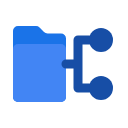

# Cloner: learn Google Apps Script with one Drive button



Create one regular My Drive folder named **Clonable**. Press **Copy to Cloned** in the Drive sidebar. Cloner creates **Cloned alongside Clonable in the same parent**, then copies the files and nested folders in the background. No name input, template selection, or separate destination setup.

**[Illustrated walkthrough](https://marclar.tech/blog/google-apps-script-drive-folder-automation/)** · **[Copyable AI-agent prompt](docs/customize-with-ai.md)** · **[Cleanup review and limitations](docs/cleanup-review.md)**

## What this teaches

Google Apps Script runs JavaScript instructions on Google's servers. Its built-in services can automate Drive, Gmail, and Sheets. This app uses Drive only: it copies folders and files, including a Sheet as a file. It does not send email or edit spreadsheet cells. See [Google's service guide](https://developers.google.com/apps-script/guides/services).

Cloner verifies that the configured source is named exactly `Clonable`, resolves exactly one accessible parent, and refuses an existing sibling folder named `Cloned`. A wrong source name or no accessible parent fails before output is created. Use a regular folder in My Drive, not My Drive itself, a shortcut, or a shared-drive folder. You need source read/copy access and **write access to its parent**.

The app never overwrites or deletes an existing Cloned. **Resume** continues the saved job in the same partial Cloned. **Done does not guarantee every item copied**: inspect skipped items and actual output. This is not backup or synchronization software, and it does not reproduce source sharing settings.

## 1. Create only the source and sample contents

Use a desktop browser and the same Google account throughout. Work/school administrators may restrict Apps Script or test add-ons. Start with invented data, not important documents. A separate practice account with no sensitive files is safer because authorization is broad.

In **My Drive**, create `Clonable` and this tiny example:

```text
My Drive/
└── Clonable/
    ├── Welcome Doc
    ├── Checklist Sheet
    └── Documents/
        └── Samples/
            └── sample.txt
```

Make Welcome Doc a Google Doc containing “Practice only.” Make Checklist Sheet a Google Sheet with “Practice task” in A1. Add a small harmless text file under Documents/Samples. Optionally create a private **Cloner Sandbox** in My Drive and put Clonable inside it instead. That sandbox becomes the parent; the app will create Cloned there. **Do not create Cloned yourself. No destination folder is needed.** Keep the parent's sharing restricted for this test.

## 2. Install your own test add-on

1. Open [script.google.com](https://script.google.com/) and create a **New project**, named `Drive Cloner Sandbox`.
2. Replace the editor's `Code.gs` with this repository's complete [`Code.gs`](Code.gs). Do not paste tests or documentation into Apps Script.
3. Under **Project Settings**, enable **Show "appsscript.json" manifest file in editor**. Replace that file with [`appsscript.json`](appsscript.json). Keep V8; adjust the timezone if needed. The manifest declares the add-on host, callback, logo, and permissions.
4. Open **Clonable** in Drive. Copy only the ID after `/folders/` in its URL, excluding any `?` query parameters. Do not copy the parent ID or the whole URL.
5. In your **private Apps Script editor**, replace only the placeholder between quotes in this one setting:

   ```js
   const CLONABLE_FOLDER_ID = 'PASTE_CLONABLE_FOLDER_ID';
   ```

   Keep the placeholder in public files. No parent ID or output ID is configured. A folder ID is not a password, but there is no reason to publish it or paste it into an AI chat. Never make your folders public to get the app working.
6. Save. Choose **Deploy → Test deployments**, select **Google Workspace Add-on** if prompted for a type, then **Install → Done**. This is not a web-app deployment or Marketplace publication. Reload Drive and open Cloner in the right-side panel. See [Google's test-add-on instructions](https://developers.google.com/workspace/add-ons/how-tos/testing-workspace-addons).
7. Review authorization before accepting. The manifest requests broad **Drive access** (`drive`) and **script trigger management** (`script.scriptapp`) to schedule the worker. The configured folder ID limits the code's intended task, **not the OAuth permission grant**. There are no Gmail- or Sheets-specific scopes.

Authorize only code you have reviewed and trust. An unverified-app warning is not a reason to bypass safeguards: verify the project and permissions. If your administrator blocks installation, stop and ask them. Follow Google's setup guidance for your account rather than changing Cloud projects, enabling billing, or weakening security at random.

Start from the sidebar button, not the editor's Run button on a callback. Do not create a recurring trigger manually; the code schedules its own workers.

## 3. Smoke-test the copy

A smoke test is a small trial of the basic path, not a guarantee about large jobs.

1. Click **Copy to Cloned** once. There is no field to fill in or template to select. Do not start another job in a second tab.
2. Use **Check progress** to refresh the status snapshot. Scheduling may be delayed.
3. Use **Open folder**. Verify Cloned is a sibling of Clonable: both directly in My Drive, or both inside your optional Cloner Sandbox.
4. Inspect Welcome Doc, Checklist Sheet, and Documents/Samples/sample.txt inside Cloned. There should not be another enclosing Clonable folder inside it. Open the copied files and compare their contents.
5. Wait for completion, inspect **Skipped** details, and confirm the original Clonable is unchanged. Check sharing on the new folder and files; source permissions are not duplicated.
6. Select **Start another**, then **Copy to Cloned** again. The existing sibling Cloned should cause refusal, without overwriting or deleting it.

For another fresh copy, deliberately rename or remove the existing Cloned **only after activity has stopped** and after inspecting what you want to keep. Resume an unfinished job instead if you want to continue its partial Cloned. Do not rename, move, or edit either tree while work is running or paused.

## Troubleshooting and stopping

| Symptom | What to check |
| --- | --- |
| Cannot open source | The one ID, signed-in account, and source read/copy access. |
| Wrong source name | The folder must be named exactly `Clonable`, including capitalization. This fails before output. |
| No accessible parent / ambiguous parent | Use a regular My Drive folder with exactly one accessible parent. The app does not guess an output location. No output should be created. |
| Cannot create Cloned | You need write access to Clonable's parent, not just access to Clonable. |
| Cloned already exists | Resume the saved job if appropriate. For a fresh copy, deliberately rename/remove old output after all activity stops. The app never does that for you. |
| Copy seems stuck | Use Check progress and inspect Apps Script **Executions** for authorization, quota, or trigger errors. |
| Resume appears | Fix the cause first. Resume uses the same partial Cloned; it cannot remove a quota or repair permissions. |
| Skipped items | Read the reasons and inspect the result. Done is not a completeness certificate. |
| Start over / Start another | Reset clears saved job state and queued worker triggers, not copied Drive files. An in-flight operation may take time to stop. |

To uninstall, use **Deploy → Test deployments → Uninstall**. Check the project's **Triggers** page for remaining `runCloneJob` triggers and remove them if present. Inspect Executions before manually cleaning up disposable output. Review account access at [Google Account connections](https://myaccount.google.com/connections).

## Behind the button

`onHomepage` builds the sidebar; `onCreate` validates the source and parent, refuses a sibling Cloned, creates output, and schedules `runCloneJob`. The existing resumable worker copies files and nested folders, saving a queue (folders left to do) and a position in per-user properties. `onCheckProgress`, `onResume`, and `onReset` provide the other controls.

Recovery compares names and counts, not durable source-to-copy identities. Checkpoints are not transactional, concurrent users are not fully coordinated, and very wide trees can exhaust property storage. Do not treat counters as an integrity check.

**Unresolved platform caveat:** the worker uses a voluntary 4.5-minute slice and requests rapid continuation triggers. Google's [quota table](https://developers.google.com/apps-script/guides/services/quotas) lists a **30-second Google Workspace add-on runtime**, and its [installable-trigger guide](https://developers.google.com/apps-script/guides/triggers/installable) says add-ons can use time-driven triggers **at most once per hour**. The code settings do not prove those assumptions work in this deployment. A live Google test is required; larger copies may need a separately designed standalone worker. Keep the first source tiny and inspect Executions. Local mocks cannot resolve this caveat.

## Local regression suite versus live Google testing

With Node.js installed:

```sh
git clone https://github.com/bigpager/google-apps-script-drive-cloner.git
cd google-apps-script-drive-cloner
node tests/run.js
```

No dependency installation is needed. The local regression suite simulates Google services to exercise copying, validation, progress, interruption, and recovery. It does not authorize Google, install an add-on, copy actual Drive files, or validate platform quotas. Use the smoke test above for that separate integration check. This documentation does not claim a completed live Google test.

## Adapt it carefully

Start by changing the harmless contents of Clonable, not the fixed names or button. The [self-contained AI-agent prompt](docs/customize-with-ai.md) keeps this one-folder contract intact. Any future Gmail sending, spreadsheet-cell changes, or new scopes need a separate review and explicit approval.

## Reuse

No license is currently supplied. Public visibility alone is not an open-source license or permission to redistribute; obtain a license decision from the owner rather than inventing a grant.